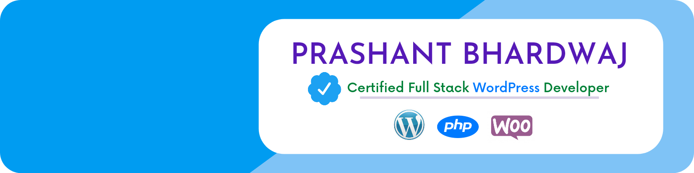

<h1 align="center">Hi,  I'm Prashant Bhardwaj</h1>
<h3 align="center">A Passionate Frontend Developer & an Enthusiast Learner 💎</h3>

  

- 🔭 I’m currently working on **#100daysofJavaScript Challenge on LinkedIn**

- 🌱 I’m currently learning **React.js & Next.js**

- 👨‍💻 All of my projects are available at [https://geekyprashant.com](https://geekyprashant.com)

- 💬 Ask me about **HTML5, CSS3, Tailwind CSS, SASS, Styled Components, Material UI, JavaScript, React.js, GIT & GitHub.**

- 📫 Drop a mail at **geekyprashant840@gmail.com**

- ⚡ Fun fact **I❤️coffee with coding and I'm extremely funny personality😀**

<h3 align="left">Connect with me:</h3>

<h3 align="left">Languages and Tools:</h3>

        

<!--       -->
 

    

## 📊 My Github Stats

   
    
  
   
  <b>Note:</b> Top languages is only a metric of the languages my public code consists of and doesn't reflect experience or skill level.

 
 

